# In-Vivo Patho Comparison PNGs

This repo includes reference PNG exports copied from:

```text
C:\SynQTI-IR\data\invivo_compare_patho
```

They live in:

```text
docs/assets/invivo_compare_patho
```

These PNGs are derived figures only. The patient NIfTI files, masks, XPS files,
and generated synthetic signal folders remain external.

## Recreate The Plots

The plot-generation logic from
`C:\SynQTI-IR\SynDTDs_MLP_patho.ipynb` cell 52 is available as package code:

```python
from pathlib import Path
from qti_unified.invivo import export_invivo_patho_winner_plots

summary = export_invivo_patho_winner_plots(
    results_root=Path(r"C:\SynQTI-IR\data\Results_2_MLP_patho"),
    brain_signal_path=Path(r"C:\SynQTI-IR\P14\og_NII_dn_db_dg_tp_mc_b0_avg.nii.gz"),
    brain_xps_path=Path(r"C:\SynQTI-IR\P14\xps_sub_min_pp.mat"),
    brain_full_xps_path=Path(r"C:\SynQTI-IR\P14\xps_full_mc.mat"),
    brain_mask_path=Path(r"C:\SynQTI-IR\P14\manual_mask.nii.gz"),
    output_dir=Path(r"C:\QTI_Unified\data\invivo_compare_patho"),
    z_idx=10,
)
```

The exporter writes one `*_winner_all4.png` per discovered patho scenario plus
`best_fit_summary_patho.csv`.

## Included PNGs

- 
- 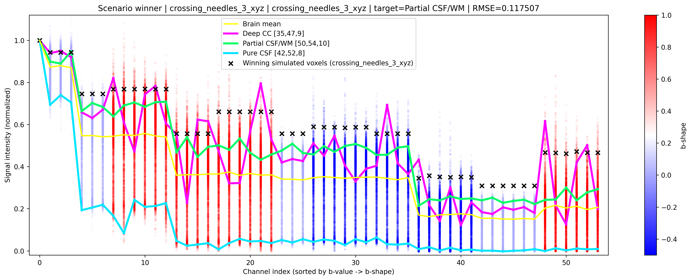
- 
- 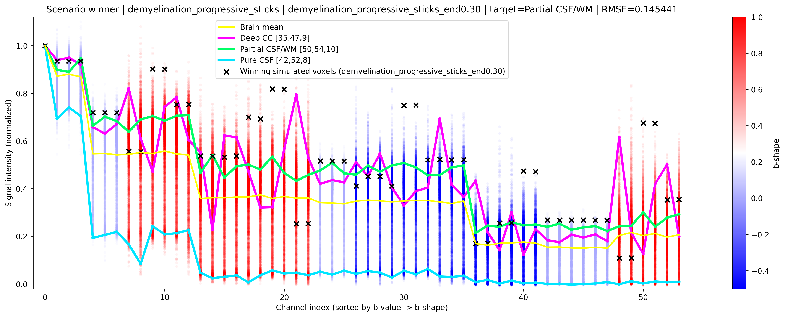
- 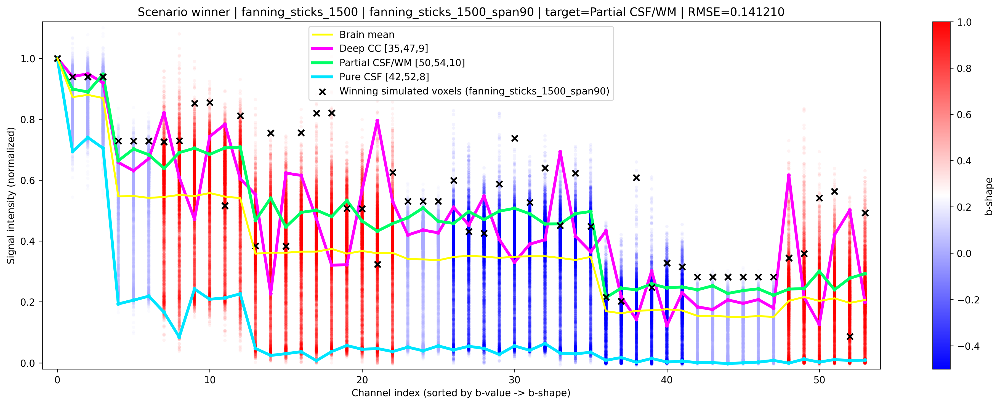
- 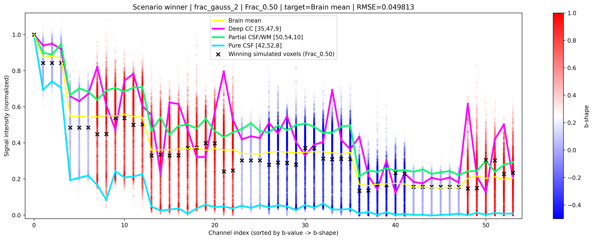
- 
- 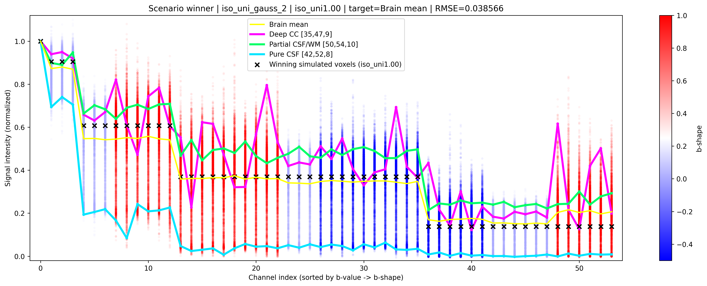
- 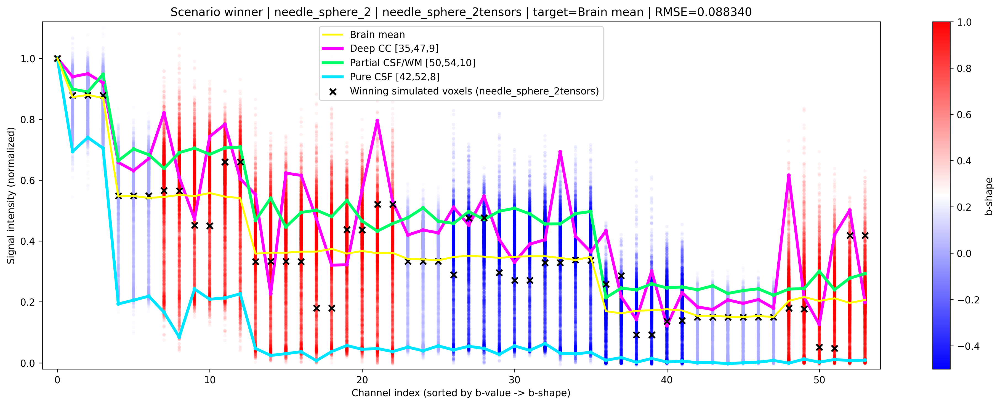
- 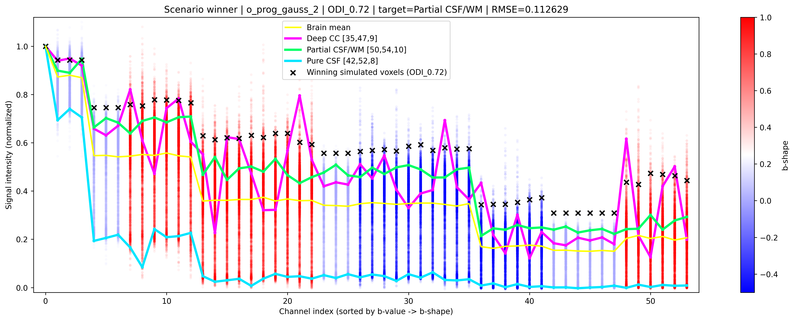
- 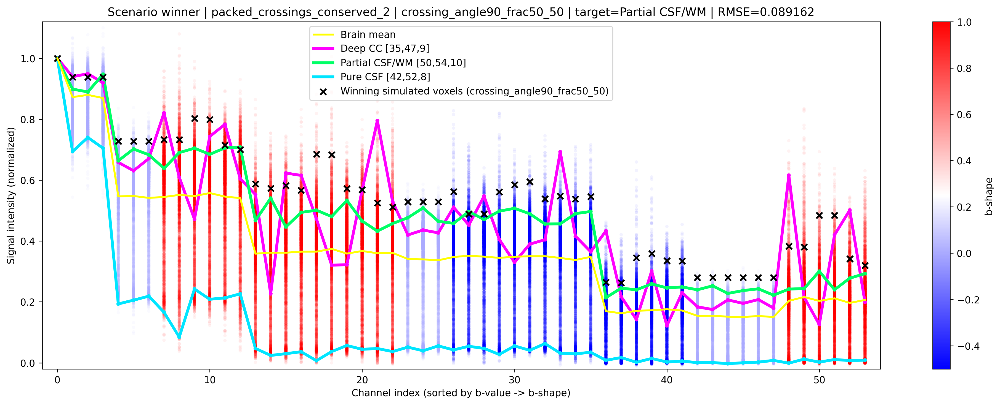
- 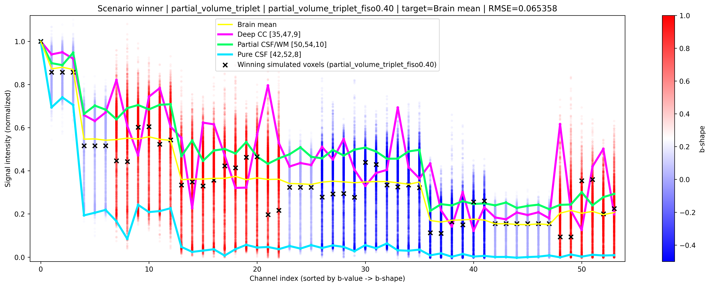
- 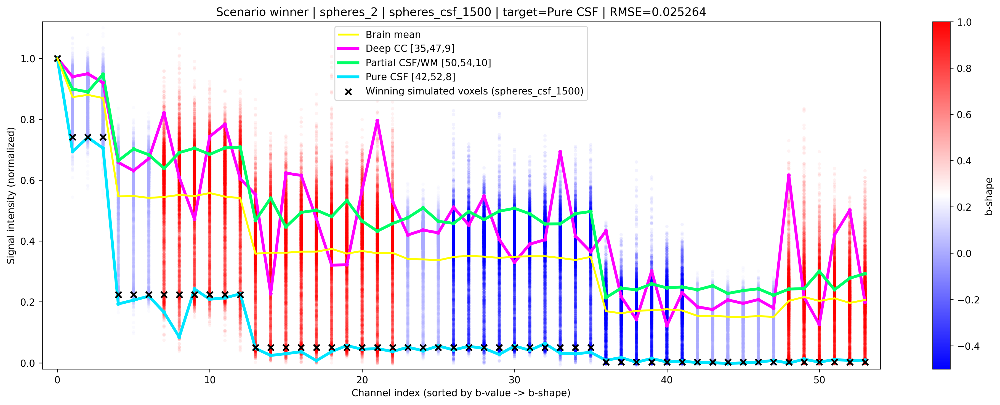
- 
- 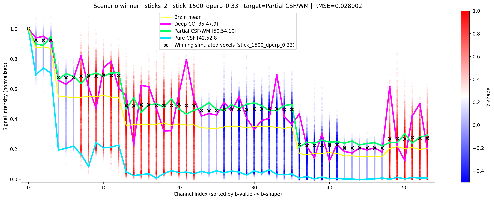
